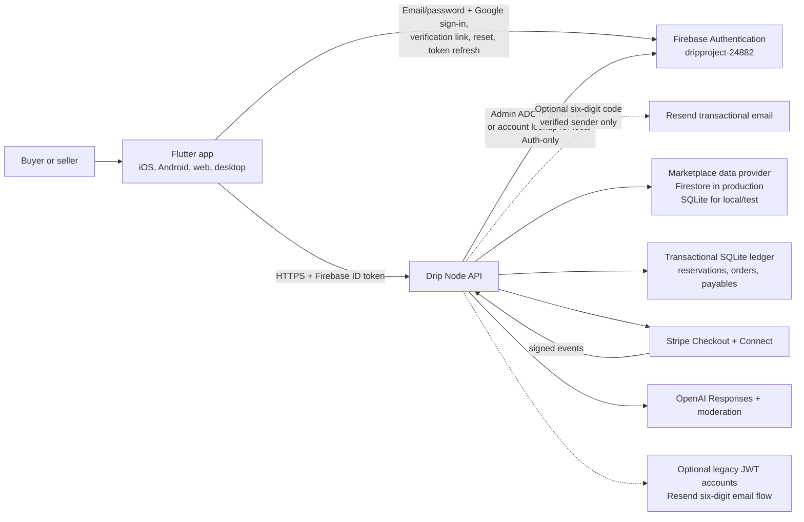
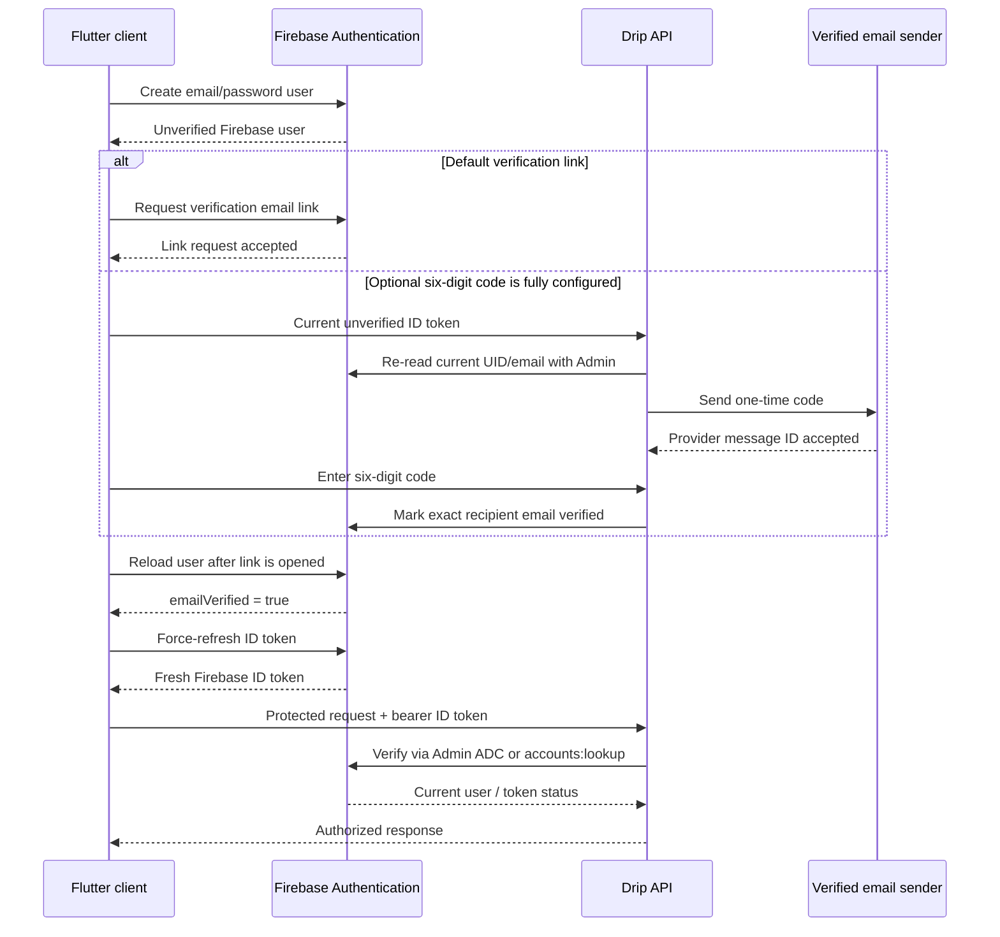

# Drip Technical Documentation

## 1. Purpose and current state

Drip is a Flutter marketplace client backed by a Node.js API. The architecture
is designed so the client can present catalog and account state, while the
server remains authoritative for authorization, sensitive configuration,
inventory reservations, prices, payments, webhooks, and AI provider access.

The native iOS and Android clients are configured for Firebase project
`dripproject-24882`. Firebase Authentication owns email/password accounts,
Google sign-in, default verification-link delivery, password reset, and client
ID-token refresh. The API also contains an optional Firebase-native six-digit
code flow, but it stays disabled until Firebase Admin credentials and a
verified transactional-email sender are supplied. The repository does
**not** contain email, Stripe, or OpenAI server credentials, and the Node API
is not automatically deployed by source configuration alone. Commerce, AI,
Firestore catalog access, numeric email codes, and production hosting become
live only after their owner-controlled services pass the readiness checklist
in section 14.

## 2. System architecture



### Trust boundaries

| Boundary | Authority |
| --- | --- |
| Flutter client | Presentation, navigation, Firebase Authentication SDK calls, encrypted token/session persistence, local preview state, and resumable checkout reference |
| Firebase Authentication | Email/password and Google identity, default email-verification and password-reset delivery, user-disabled state, token issuance, and token refresh |
| Drip API | Firebase bearer-token verification, optional code verification through Admin, authorization, validation, rate limits, provider readiness, server-owned catalog context, and all email/payment/AI provider calls |
| Marketplace data provider | Approved production catalog documents |
| Transactional SQL database | Checkout attempts, reservations, orders, Stripe event IDs, seller payables, and optional legacy account/email-outbox records |
| Stripe | Payment collection, Checkout Session state, connected-account capability state, and provider event source |
| Resend | Optional six-digit Firebase confirmation delivery and optional legacy JWT confirmation/welcome delivery; never identity authority |
| OpenAI | Moderation and structured concierge generation; never catalog or price authority |

The split is deliberate: Firestore is selected for production catalog reads,
Firebase Authentication owns primary account identity, and payment records
remain in the transactional store whose constraints are tied to checkout.
The production storage volume must provide encryption at rest and restricted
runtime access. Duplicating authentication secrets into public marketplace
documents would create consistency and security risks. Seller/profile records
that are added later must key authorization to the stable Firebase UID and stay
behind authenticated server contracts.

## 3. Repository layout

```text
lib/
  main.dart                    Composition root and account readiness
  api_endpoint.dart            Canonical public API URL validation
  app_state.dart               Marketplace UI facade and checkout resume state
  auth/                        Firebase/Google signup, verification, reset, sessions
  assistant/                   Concierge contracts, redaction, HTTP gateway
  payments/                    Checkout and Stripe Connect gateways/controllers
  *_page.dart                  Product screens
server/
  src/config.js                Environment parsing and production gates
  src/http-server.js           HTTP routes, CORS, limits, error mapping
  src/database.js              Transactional SQLite schema and queries
  src/marketplace-database.js  SQLite/Firestore marketplace provider boundary
  src/firebase-auth.js         Firebase Admin/REST ID-token verification
  src/firebase-email-code-service.js
                               Optional Firebase-bound six-digit code service
  src/account-service.js       Optional legacy passwords, JWT sessions, outbox
  src/checkout-service.js      Quotes, reservations, Checkout, fulfillment
  src/connect-service.js       Connected-account onboarding and status
  src/ai-service.js            Trusted context and validated AI responses
  test/                        Service, HTTP, provider, and security tests
test/                          Flutter unit and widget tests
docs/                          Product, business, technical, and launch docs
```

## 4. Data design

### Production provider selection

`MARKETPLACE_DATABASE_PROVIDER` selects the non-financial marketplace provider:

- `sqlite`: local development and deterministic tests.
- `firestore`: production catalog provider through the Firebase Admin SDK and
  Application Default Credentials.

Firestore selection requires a valid Firebase project ID and explicit
Application Default Credentials mode. Startup reads
`_drip_system/connectivity` as a bounded connectivity/authorization probe.
Invalid configuration, missing or denied credentials, an unreachable project,
or malformed Firestore documents stops the provider from reporting ready; the
service does not silently fall back to SQLite or demo data.

The Firebase Admin credential must be injected by the hosting platform. Do not
copy a service-account JSON file into Flutter assets, web files, the repository,
or an environment variable exposed to the browser.

The repository's `firestore.rules` denies every direct client read and write.
The intended path is Flutter → Drip API → Firebase Admin. `firebase.json` and
`firestore.indexes.json` keep the deny-by-default rules and index configuration
deployable with the Firebase CLI.

### Catalog contract

Production listing documents are validated at the API boundary. The contract
includes:

- stable lowercase/hyphenated listing ID;
- item and brand display names;
- seller handle;
- integer `priceCents`;
- three-letter lowercase currency;
- bounded list of available sizes;
- explicit `live`, `reserved`, `sold`, or `paused` status;
- optional deterministic sort order.

The API rejects a collection that exceeds its bounded read size or contains an
invalid document. It does not coerce suspicious values into saleable
inventory.

### Financial data

All prices and fees use integer cents. A Checkout attempt stores:

- buyer and stable attempt ID;
- request fingerprint and Stripe idempotency key;
- authoritative inventory and fee snapshot;
- reservation expiry;
- Checkout Session/PaymentIntent identifiers;
- webhook and fulfillment state;
- per-seller payable entries.

One-of-one inventory is reserved transactionally before Stripe is called.
Payment completion is monotonic: a late expiration cannot turn a paid order
back into an unpaid one.

### Device data

Firebase Authentication persists the signed-in mobile user through its native
SDK, while Drip keeps the current API bearer material in Keychain/Keystore
through secure storage. The app reloads the Firebase user after verification
and force-refreshes the ID token before opening a protected Drip session.
Flutter web session storage is scoped to the browser tab and requires HTTPS or
localhost. Shared preferences hold non-secret UI and preview state. Stripe
secrets, OpenAI keys, service-account credentials, password hashes, raw card
data, and webhook secrets are never stored by Flutter.

## 5. Local setup

### Prerequisites

- Flutter compatible with Dart `^3.12.2`
- Node.js `24.12.0` or newer
- Stripe CLI for real test-mode webhook forwarding
- A supported iOS/Android simulator or a modern browser

### Client-only preview

```sh
flutter pub get
flutter run
```

The configured iOS and Android builds can create email/password Firebase
accounts, use Google sign-in, send email-verification links, and request
password-reset email whenever Firebase is reachable. Protected catalog,
concierge, seller, and checkout actions still need a reachable Drip API that
verifies the current Firebase ID token. Numeric email codes, Stripe, and
OpenAI remain unavailable until their server configuration is supplied.

### Connected local stack

```sh
cd server
cp .env.example .env
npm install
npm start
```

Then run Flutter:

```sh
flutter run \
  --dart-define=DRIP_API_URL=http://localhost:4242
```

The API anchors `.env` and relative database paths to `server/` even if it is
started from an IDE or with `npm --prefix server start`. For Auth-only local
development, configure `AUTH_MODE=firebase`,
`FIREBASE_AUTH_VERIFIER_MODE=rest-api-key`, and the Web API key for
`dripproject-24882`. This mode verifies each bearer token through Firebase's
official account-lookup endpoint and does not require a service-account file.

## 6. Configuration reference

### Flutter build-time defines

| Define | Required | Purpose |
| --- | --- | --- |
| `DRIP_API_URL` | Production | Canonical protected API origin used by catalog, AI, seller tools, session checks, and commerce; production accepts HTTPS only |
| `DRIP_CHECKOUT_API_URL` | No | Legacy fallback for older builds; do not use for new deployments |
| `DRIP_AI_API_URL` | No | Optional AI-service override; normally use the canonical API |
| `DRIP_ENABLE_DEMO_MODE` | Preview only | Explicit local demonstration; must not be enabled in a production build |

No secret belongs in a Dart define. Flutter web embeds defines in downloadable
client code.

### Server: runtime and data

| Variable | Typical value | Notes |
| --- | --- | --- |
| `NODE_ENV` | `development` or `production` | Enables stricter production checks |
| `HOST` | `127.0.0.1` | Bind address |
| `PORT` | `4242` | HTTP port |
| `DATABASE_PATH` | `./data/drip.sqlite` | Durable transactional SQL database; production cannot use `:memory:` |
| `MARKETPLACE_DATABASE_PROVIDER` | `sqlite` or `firestore` | Non-financial marketplace data provider |
| `FIREBASE_PROJECT_ID` | `dripproject-24882` | Required for Firebase auth verification or Firestore |
| `FIREBASE_AUTH_VERIFIER_MODE` | `application-default` or `rest-api-key` | Admin ADC is preferred in production; REST lookup supports local/self-hosted Auth-only |
| `FIREBASE_WEB_API_KEY` | Firebase Web API key | Required only by `rest-api-key`; it must belong to the same Firebase project |
| `FIREBASE_CREDENTIALS_MODE` | `application-default` | Required for Admin auth verification and always required for Firestore |
| `FIREBASE_CONNECT_TIMEOUT_MS` | `10000` | Bounded startup/provider request timeout |
| `CORS_ALLOWED_ORIGINS` | `https://app.example.com` | Comma-separated exact origins; wildcards are rejected |

Application Default Credentials are provided by the runtime, commonly through
a workload identity or a server-only `GOOGLE_APPLICATION_CREDENTIALS` path.
That provider variable is consumed by Google libraries; it must never reach
Flutter. The Web API key used by REST lookup is not a service-account private
key; never substitute one for the other or print either value in logs.

### Server: authentication

| Variable | Purpose |
| --- | --- |
| `AUTH_MODE` | `firebase` for the app; `development` for a fixed local demo; `jwt` only for the optional legacy account service |
| `DEV_BUYER_ID` | Fixed local buyer identifier |
| `DEV_BUYER_SELLER_HANDLE` | Fixed local seller identity |
| `ACCOUNT_AUTH_ENABLED` | Keep `false` in Firebase mode; enables only the optional legacy JWT signup/login routes |

The optional Firebase-native code flow keeps `AUTH_MODE=firebase` and
`ACCOUNT_AUTH_ENABLED=false`:

| Firebase code variable | Purpose |
| --- | --- |
| `FIREBASE_EMAIL_CODE_ENABLED` | Explicitly enables the isolated code routes |
| `FIREBASE_EMAIL_CODE_SECRET` | Dedicated 32+ byte HMAC/rate-limit secret |
| `FIREBASE_EMAIL_CODE_TTL_SECONDS` | Code lifetime; default 10 minutes |
| `FIREBASE_EMAIL_CODE_RESEND_COOLDOWN_SECONDS` | Minimum wait between sends |
| `FIREBASE_EMAIL_CODE_RESEND_LIMIT_PER_HOUR` | Per-UID send limit |
| `FIREBASE_EMAIL_CODE_IP_REQUEST_LIMIT_PER_HOUR` | Per-IP send limit |
| `FIREBASE_EMAIL_CODE_ATTEMPT_LIMIT_PER_15_MINUTES` | UID/IP guess window |
| `FIREBASE_EMAIL_CODE_MAX_ATTEMPTS` | Guesses before a code is consumed |
| `EMAIL_PROVIDER` | Must be `resend` when codes are enabled |
| `RESEND_API_KEY` | Server-only email-provider credential |
| `WELCOME_EMAIL_FROM` | Transactional sender on an owner-verified domain |

This mode requires `FIREBASE_AUTH_VERIFIER_MODE=application-default`; the REST
API-key verifier cannot update `emailVerified`. Flutter opts in separately
with `DRIP_FIREBASE_EMAIL_CODE_ENABLED=true` and the deployed HTTPS
`DRIP_API_URL`. Without both sides enabled, the app continues to use
Firebase’s verification link.

The following variables apply only when deliberately running the optional
legacy built-in account service with `AUTH_MODE=jwt`:

| Legacy variable | Purpose |
| --- | --- |
| `JWT_HS256_SECRET` | JWT signing secret, at least 32 random bytes |
| `JWT_ISSUER` / `JWT_AUDIENCE` | Required claim values |
| `AUTH_SESSION_TTL_SECONDS` | Session lifetime |
| `AUTH_SIGNUP_RATE_LIMIT_PER_HOUR` | Signup abuse limit |
| `AUTH_LOGIN_RATE_LIMIT_PER_15_MINUTES` | Login abuse limit |
| `AUTH_VERIFICATION_CODE_TTL_SECONDS` | Confirmation-code lifetime |
| `AUTH_VERIFICATION_RESEND_COOLDOWN_SECONDS` | Minimum wait between resends |
| `AUTH_VERIFICATION_RESEND_LIMIT_PER_HOUR` | Resend abuse limit |
| `AUTH_VERIFICATION_ATTEMPT_RATE_LIMIT_PER_15_MINUTES` | Confirmation attempt limit |
| `AUTH_PENDING_ACCOUNT_TTL_SECONDS` | Pending-account replacement window |
| `AUTH_RATE_LIMIT_SECRET` | Separate keyed hashing secret for rate-limit scopes |
| `EMAIL_PROVIDER` | `disabled` or `resend` |
| `RESEND_API_KEY` | Server-only Resend key |
| `WELCOME_EMAIL_FROM` | Sender on an owner-verified domain |
| `EMAIL_TIMEOUT_MS` | Provider request timeout |
| `WELCOME_EMAIL_RETRY_INTERVAL_MS` | Outbox worker interval |

### Server: Stripe

| Variable | Purpose |
| --- | --- |
| `STRIPE_SECRET_KEY` | Restricted or secret server key |
| `STRIPE_WEBHOOK_SECRET` | Checkout webhook signing secret |
| `CHECKOUT_SUCCESS_URL` | HTTPS return URL containing `{CHECKOUT_SESSION_ID}` |
| `CHECKOUT_CANCEL_URL` | HTTPS cancel URL |
| `CHECKOUT_ALLOWED_COUNTRIES` | Allowed shipping countries |
| `CHECKOUT_RESERVATION_MINUTES` | Inventory hold duration; current default 31 |
| `STRIPE_CONNECT_ENABLED` | Enables seller recipient onboarding |
| `STRIPE_CONNECT_WEBHOOK_SECRET` | Separate Connect event signing secret |
| `CONNECT_ONBOARDING_RETURN_URL` | HTTPS seller return URL |
| `CONNECT_ONBOARDING_REFRESH_URL` | HTTPS informational refresh URL |
| `CONNECT_DEFAULT_COUNTRY` | Default connected-account country |
| `CONNECT_DEFAULT_CURRENCY` | Default payout currency |
| `REQUIRE_CONNECT_PAYOUTS` | Blocks checkout when seeded sellers are not transfer-ready |

### Server: AI

| Variable | Purpose |
| --- | --- |
| `AI_ENABLED` | Explicitly enables provider calls |
| `OPENAI_API_KEY` | Restricted server project key |
| `OPENAI_MODEL` | Configurable response model |
| `OPENAI_MODERATION_MODEL` | Moderation model |
| `AI_TIMEOUT_MS` | Provider timeout |
| `AI_MAX_OUTPUT_TOKENS` | Output ceiling |
| `AI_RATE_LIMIT_PER_MINUTE` | Per-buyer burst limit |
| `AI_RATE_LIMIT_PER_DAY` | Per-buyer daily limit |

Use `server/.env.example` as the configuration source of truth. Secrets belong
in an environment-specific secret manager, not in `.env` committed to source.

## 7. Firebase account, verification, and reset flow



Security properties:

- Native Firebase configuration for project `dripproject-24882` is present for
  both iOS and Android. Google’s provider, iOS reversed URL scheme, and Android
  debug SHA/OAuth client are configured.
- Signup creates the Firebase user but Drip does not mint or expose a protected
  app session while `emailVerified` is false.
- By default, the app sends Firebase's email-verification link. When the
  optional server code capability and Flutter build flag are both enabled, it
  requests and verifies a six-digit code instead. Both paths reload the user
  and force-refresh the ID token so the verified claim is not stale.
- The numeric-code path accepts unverified Firebase tokens only on its two
  narrow endpoints. UID/email are reloaded with Firebase Admin; SQLite stores
  only an HMAC digest; expiry, attempt, cooldown, UID, and IP limits are
  enforced; every other protected route still requires
  `email_verified=true`.
- Sign-in failures use bounded, generic customer-facing wording so the UI does
  not reveal whether an email address exists.
- “Forgot password?” uses Firebase password-reset email and returns a generic
  success state for enumeration-safe account recovery.
- The server requires `email_verified=true` and rejects malformed, expired,
  revoked, disabled-user, or wrong-project credentials before protected
  catalog, AI, seller, or checkout work.
- Production uses Firebase Admin with Application Default Credentials so token
  signatures, project claims, revocation, and disabled-user state are checked.
- Local/self-hosted Auth-only mode sends the exact bearer token to Firebase's
  HTTPS `accounts:lookup` endpoint, then validates the returned current user,
  stable UID, email-verification state, project claims, expiry, and
  `validSince` revocation boundary. It fails closed on timeout, malformed
  response, redirect, or provider error.
- Signing out clears the Firebase session and Drip's locally persisted bearer
  state. Firebase password reset and account-disabled changes are enforced by
  the provider.

Firebase UID is the stable identity key presented to authenticated server
contracts. Authentication secrets never move into Firestore catalog
documents.

### Optional legacy built-in account mode

The server still contains an explicitly opt-in legacy account implementation
for controlled deployments that select `AUTH_MODE=jwt`,
`ACCOUNT_AUTH_ENABLED=true`, production JWT/rate-limit secrets, and a verified
Resend sending domain. That mode owns its own password hashes, pending account,
six-digit verification-code, revocable JWT session, and email-outbox records.
It is not required or called by the Firebase-native Flutter flow.

## 8. Stripe Checkout and Connect

### Buyer checkout

1. Flutter submits listing IDs, selected sizes, and a stable attempt ID.
2. The server reloads inventory and computes item, fee, shipping, and tax
   snapshots using integer cents.
3. A transaction reserves available one-of-one inventory.
4. The server persists the quote and Stripe idempotency key.
5. Stripe creates a hosted Checkout Session.
6. Flutter opens Stripe's HTTPS page; Drip never receives card fields.
7. Stripe posts a signed event to `/v1/stripe/webhook`.
8. The server retrieves and revalidates the Session, then fulfills once.
9. The app's return page polls server state; the redirect is not payment proof.

If payment arrives after inventory was validly released, the order enters
manual payment review rather than overselling.

### Seller Connect

Authenticated sellers can request an Accounts v2 recipient account, open a
single-use Stripe-hosted onboarding link, synchronize transfer/payout
capabilities through a separate signed destination, and request a short-lived
Express Dashboard link.

The current system records seller payables as `awaiting_connect` or `held`. It
does not claim that a separate Transfer or bank payout has been sent. Transfer,
refund, dispute, reversal, and reconciliation workers remain production gates.

## 9. Drip Concierge

Drip Concierge is a server-owned integration. The app sends a bounded question
and recent transcript; it does not send an API key or make a direct OpenAI
request.

The server:

- requires an authenticated buyer in connected mode;
- blocks likely card numbers, CVC/CVV values, passwords, API keys, and tokens
  before provider calls;
- moderates the request and fails closed if moderation is unavailable;
- supplies trusted catalog, fee, and marketplace policy context;
- uses a versioned instruction set and structured response schema;
- sets `store: false`;
- uses a hashed safety identifier;
- validates every returned listing ID, availability claim, and money value;
- supports complete outfits, fit/proportion, color, dress code, garment care,
  weather layering, cultural/religious clothing, and unusual style ideas;
- keeps guidance body-neutral and does not make medical claims;
- asks at most one focused follow-up when missing information materially
  changes the answer.

When AI is disabled or unconfigured, the production API returns
`ai_unavailable`; it does not pretend a keyword fallback is the connected AI.

## 10. HTTP readiness and error behavior

`GET /healthz` is the first deployment check. The client uses readiness fields
to decide whether account and payment actions can be enabled. A reachable
process is not enough: each capability must report configured.

`GET /v1/catalog` reads through the selected marketplace provider.
`/healthz.databaseProvider` reports `sqlite` or `firestore`, allowing staging
and deployment checks to prove which source is active without exposing
credentials. A connected app deployment should also report
`authProvider: "firebase"` and `accountAuthConfigured: true`; payment remains
independent under `paymentsConfigured`.

Provider and validation errors use bounded public messages. Responses
containing checkout or account state use `Cache-Control: no-store`. Exact CORS
origins are required for web; requests without an `Origin`, such as native
clients and Stripe CLI, remain supported.

Production configuration rejects:

- development auth;
- an in-memory transactional database;
- non-HTTPS provider return URLs;
- wildcard CORS;
- malformed or mismatched live Stripe configuration;
- selected Firestore without a valid project and Application Default
  Credentials mode;
- Firebase auth without a project and either Admin ADC or the matching REST
  lookup configuration;
- the optional built-in account service without JWT and real Resend
  configuration;
- enabled AI without a server API key.

## 11. Security checklist

- Keep all provider keys in a deployment secret manager.
- Use different secrets for Checkout and Connect webhooks. If legacy JWT
  accounts are deliberately enabled, also separate JWT signing and rate-limit
  hashing secrets.
- Rotate credentials after suspected exposure; rebuilding Flutter does not
  remove a secret already shipped to a browser.
- Use HTTPS for app, API, checkout returns, and onboarding returns.
- Restrict CORS to exact production origins.
- Grant Firebase Admin access through least-privilege workload identity where
  practical.
- Match every Firebase token's project, current UID, verified-email state,
  disabled state, expiry, and revocation boundary before authorization.
- Keep Firestore client access disabled unless separately designed and audited;
  the intended path is Flutter → Drip API → Firebase Admin.
- Verify Stripe signatures against the raw request body.
- Never treat a browser return as payment confirmation.
- Keep catalog price/status server-owned during checkout.
- Avoid logging authorization headers, passwords, codes, card-like text,
  provider payload secrets, or full AI prompts containing user input.
- Back up and test restoring the transactional database.
- Add production audit logs, metrics, alerts, dependency scanning, and incident
  response before launch.

## 12. Testing and verification

Run the standard suite:

```sh
flutter analyze
flutter test
cd server && npm test
flutter build web --release
```

Before a mobile release:

```sh
flutter build ios --release --no-codesign
flutter build appbundle --release
```

Provider integration tests should use sandbox/test accounts:

1. Start with Stripe/OpenAI disabled and verify those features fail closed with
   accurate UI while Firebase account access remains independent.
2. Start with the local SQLite provider and run all server tests.
3. Verify the server against `dripproject-24882` first with local REST lookup
   and then with production-equivalent Admin ADC. Confirm wrong-project,
   expired, unverified, disabled, and revoked users fail closed.
4. Create a fresh account, receive the real Firebase verification link, open
   it, refresh the ID token, restore the session, request password reset, and
   sign out. Separately revoke the user's refresh tokens and confirm a
   previously issued credential is rejected.
5. Point a staging deployment at the Firestore catalog and validate provider
   readiness plus malformed-document rejection.
6. Forward Stripe test webhooks and complete a test Checkout.
7. Replay the same event and request attempt; verify no duplicate order.
8. Cancel or expire Checkout; verify inventory release.
9. Complete Connect onboarding with a test recipient and verify capability
   synchronization.
10. Ask the concierge ordinary, ambiguous, unusual, care, dress-code, prompt
   injection, and sensitive-data questions.
11. Build web in release mode with the staging HTTPS API and perform keyboard,
    narrow-screen, wide-screen, dark-mode, and reduced-motion checks.

## 13. Deployment

### API

1. Provision an HTTPS Node.js 24.12+ runtime with persistent transactional
   storage.
2. Use Firebase project `dripproject-24882`; create and populate the approved
   Firestore collections if Firestore is selected.
3. Attach least-privilege Application Default Credentials to the runtime and
   select Firebase Admin token verification.
4. Store all environment-specific secrets in the platform secret manager.
5. Set `NODE_ENV=production`, `AUTH_MODE=firebase`, exact CORS, the production
   provider, and HTTPS return URLs.
6. Deploy without live Stripe keys first and verify `/healthz`.
7. Verify Firebase signup, verification link, password reset, token refresh,
   and protected API access in staging.
8. Configure Stripe test keys and both signed event destinations.
9. Add restricted OpenAI credentials only after concierge evaluations pass.
10. Run the end-to-end staging checklist.
11. Enable live Stripe credentials only after operations and legal gates are
    signed off.

### Flutter web

```sh
flutter build web --release \
  --dart-define=DRIP_API_URL=https://api.your-domain.example
```

Deploy `build/web/` behind HTTPS. Do not set demo mode. Configure the API's CORS
list with the exact deployed origin, then verify account, AI, catalog, checkout
return, deep-link, and responsive behavior on the production domain.

### Mobile

Use owner-controlled bundle IDs, signing teams, store accounts, privacy
declarations, support contacts, and universal/app links. Release builds must
point to the production HTTPS API. Confirm Keychain/Keystore entitlements and
account-deletion requirements before store submission.

## 14. Honest readiness checklist

### Implemented in the repository

- [x] Responsive Flutter marketplace UI and branded content
- [x] Firebase project `dripproject-24882` configured for iOS and Android
- [x] Firebase email/password signup, verification link, password reset,
      Google sign-in, login, token refresh, session restore, profile, and
      logout
- [x] Optional Firebase-bound six-digit code routes, HMAC-only storage,
      rate limits, Admin verification, and method-aware Flutter UX
- [x] Server-side Firebase token, verification, disabled-user, and revocation
      checks through production Admin ADC or local Auth-only REST lookup
- [x] Stripe-hosted Checkout with authoritative totals and signed webhooks
- [x] Transactional one-of-one reservations and idempotent checkout attempts
- [x] Stripe Connect recipient onboarding and capability visibility
- [x] Firestore/SQLite marketplace provider selection with production
      fail-closed behavior
- [x] Server-owned AI concierge integration and validation
- [x] README, Business Model Canvas, technical documentation, and roadmap
- [x] Automated Flutter/server checks and production web build path

### Requires owner credentials or infrastructure

- [ ] Populate reviewed Firestore catalog records if Firestore is selected
- [ ] Attach production Firebase Admin credentials/workload identity to the
      deployed API
- [ ] Verify an owned transactional-email domain, store the Resend key and
      code secret in the deployment secret manager, then activate and
      inbox-test the numeric-code path
- [ ] Replace Android debug release signing and register upload/Play signing
      SHA fingerprints with Firebase
- [ ] Deploy the Node API and transactional database over HTTPS
- [ ] Add restricted OpenAI project credentials and approve model evaluations
- [ ] Configure Stripe test keys and separate Checkout/Connect destinations
- [ ] Complete a webhook-confirmed test purchase and test seller onboarding
- [ ] Configure live Stripe keys only after launch approval
- [ ] Deploy and connect the final production web origin

### Business/operations launch gates

- [ ] Tax policy and product tax codes
- [ ] Refund, dispute, reversal, and transfer lifecycle
- [ ] Double-entry reconciliation and payout operations
- [ ] Shipping labels, tracking, delivery confirmation, and claim windows
- [ ] Marketplace moderation, prohibited-items policy, and enforcement
- [ ] Privacy policy, terms, seller agreement, and account deletion
- [ ] Customer support ownership and escalation targets
- [ ] Monitoring, alerting, backups, restore drill, and incident response
- [ ] Accessibility and cross-device release review
- [ ] Load and concurrency testing against production-like infrastructure

## 15. Known gaps

- Firestore support is a server integration boundary, not evidence that an
  owner project is connected or populated.
- The transactional SQLite design targets one service instance. Horizontal
  scaling requires a migration that preserves uniqueness, transactions,
  webhook idempotency, and ledger constraints.
- Seller listing publication and every account/profile mutation must remain
  authenticated and server-validated as provider coverage expands.
- Tax is currently zero in the stored quote.
- Transfers, refunds, disputes, shipping labels, and final reconciliation are
  not complete production operations.
- Local seller analytics and growth controls include planning/demo behavior
  until server-authoritative entitlements and events are complete.
- AI quality requires a versioned evaluation set and production monitoring.
- Firebase accepting a verification or password-reset email request is not
  proof that the message reached the inbox; delivery and spam placement remain
  external operational concerns.
- No security architecture can promise that users “cannot be hacked.”
  Drip reduces specific risks through least privilege, Firebase email proof,
  provider-managed password handling, token revocation, provider-hosted
  payment, and
  fail-closed configuration, but ongoing patching and operations remain
  necessary.

## 16. Change discipline

Any change to fees, catalog fields, identity claims, Stripe event handling,
Firestore collections, or AI output schema should update:

1. server validation and database constraints;
2. automated tests;
3. Flutter contracts and error states;
4. this document and `server/.env.example`;
5. the Business Model Canvas when economics change;
6. the demo and pitch materials when customer-visible behavior changes.
